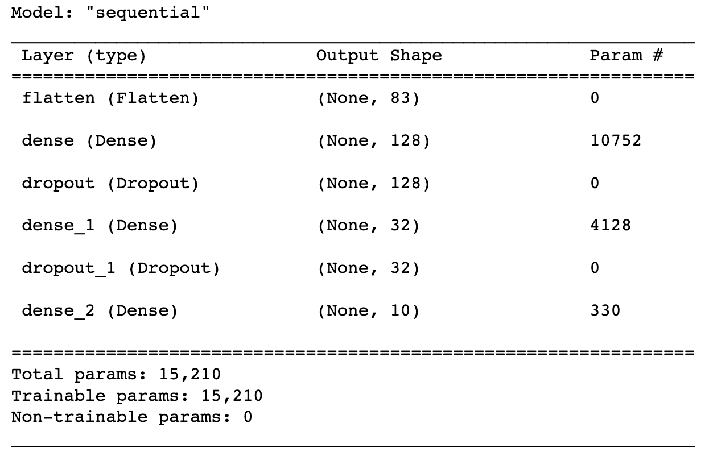
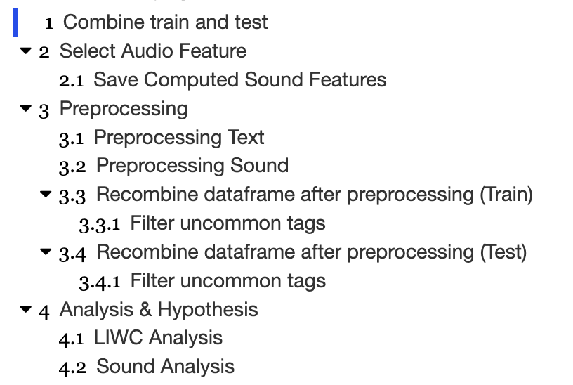
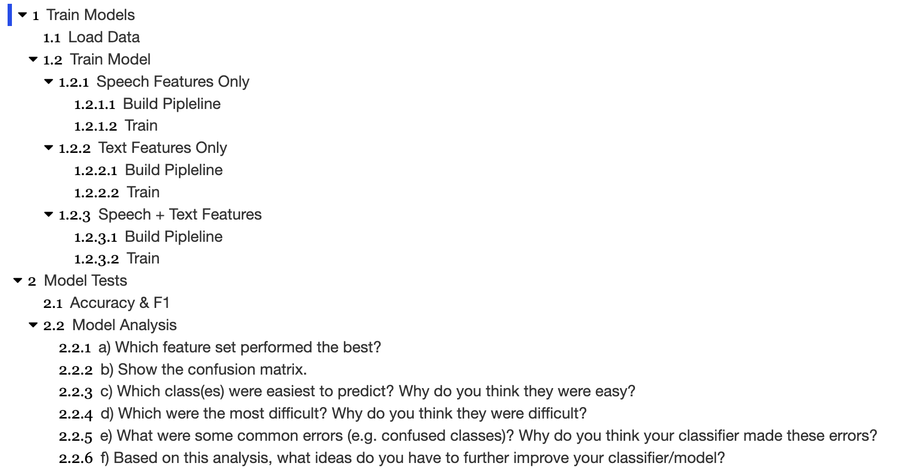

# Dialogue Act Recognition

[Analyze Dialogue Act Recognition (DAR)](http://compprag.christopherpotts.net/swda.html) from audio and text features, compare how different features affect predictions of DAR tags. 

## Installation


This project utilize [jupyter notebook](https://jupyter.org/) and [python 3.10.1](https://www.python.org/) for analysis, please make sure it is installed.  Main packages used in this project: [parselmouth](https://parselmouth.readthedocs.io/en/stable/), [pandas](https://pandas.pydata.org/), [matplotlib](https://matplotlib.org/), [scikit](https://scikit-learn.org/stable/), [tensorflow](https://www.tensorflow.org/). To run the project, [pip](https://pip.pypa.io/en/stable/) install all required enviroments using:

```bash
pip install <project_name>
```
Or one can also automatically install all required environments with **`environment.yml`** :

```bash
conda env update --file environment.yml --prune
```

## Components

There are two main jupyter notebook files for analysis: **`feature_extraction_and_analysis.ipynb`** and **`classification.ipynb`**. 

### Feature Extraction and Analysis

**`feature_extraction_and_analysis.ipynb`** have 3 main components: 
1. Select audio features
2. Preprocessing text and audio features
3. Analysis & Hypothesis

#### Select audio features
---
For each <b>.wav</b> file, I had selected features using parselmouth: maximum pitch, mean pitch, standard deviation of pitch, max intensity, mean intensity, standard deviation of intensity, speaking rate, jitter, shimmer, HNR. All computed sound features are saved in file **`sound_features.csv`** for later preprocessing. Speaking rate is computed using total duration of audio and aggregation of length of all corresponding transcripts.

#### Preprocessing text and audio features
---
For text features, all LIWC features are selected except identifier features (start_time, end_time). Then all LIWC features with total 0 values >= 70 are eliminated to reduce input vector sparseness, and reduce required converge time. Preprocessed text features are stored in file **`processed_train_text_features.csv`**. This preprocess step will only be done on training dataset (**`train.csv`**), not testing dataset (**`test.csv`**). 

For audio features, total duration < 1 seconds recordings will be eliminated using speaking_rate variable computed before. Preprocessed sound features are stored in file **`processed_sound_features.csv`**.

For convinence, I had combined both text and audio features using `inner join`, eliminating difference in transcripts and audios. Also, 10 most common tags are computed and kept, and other tags are removed from the joined dataset. The combined features are stored in **`combined_processed_train_filtered.csv`** and **`combined_processed_test_filtered.csv`**.

#### Analysis & Hypothesis
---
LIWC and Audio feature analysis: compared level of certainty on different tags and different speaking intensity level on different tags. Detailed visual analysis and conclusion can be shown in notebook. 

### Classification & Results

**`classification.ipynb`** have 2 main components: 
1. Model Training
2. Model Testing

#### Model Training
---
<b>Extra Preprocessing Steps</b>: numerical features are normalized and taget variable `da_tag` are one hot encoded.

Three models are trained: `Speech Features Only`, `Text Features Only`, `Speech + Text Features` with a small neural net models of total 15210 parameters. [Adam optimizer](https://www.tensorflow.org/api_docs/python/tf/keras/optimizers/Adam) and [categorical crossentropy](https://www.tensorflow.org/api_docs/python/tf/keras/losses/CategoricalCrossentropy) are used to train the model with 50 epochs each. To prevent overfitting, [Dropout](https://www.tensorflow.org/api_docs/python/tf/keras/layers/Dropout) layers are used after each [Dense](https://www.tensorflow.org/api_docs/python/tf/keras/layers/Dense) layer.

<b>General structure of the model (with input size varies for different models):</b>


#### Model Test
---
For each model trained in previous component, accuracy and macro f1 score are computed. For each class, `Speech + Text Features` model (the best performing model) was selected to perform confusion matrix and per class analysis (precision, recall, f1 score). Findings and answer to 3c can be found at the end of this section.

## Notebook Structure

### feature_extraction_and_analysis


### classification


## Important
<b>All answers to questions can be found in corresponding notebook section</b>: hypothesis and result analysis can be found in `section 4: Analysis & Hypothesis` in **`feature_extraction_and_analysis.ipynb`**; model analysis questions' answer can be found in `section 2.2: Model Analysis` in **`classification.ipynb`**.

## Contributing
Pull requests are welcome. For major changes, please open an issue first to discuss what you would like to change.


## License
[Public Domain](https://wiki.creativecommons.org/wiki/public_domain)